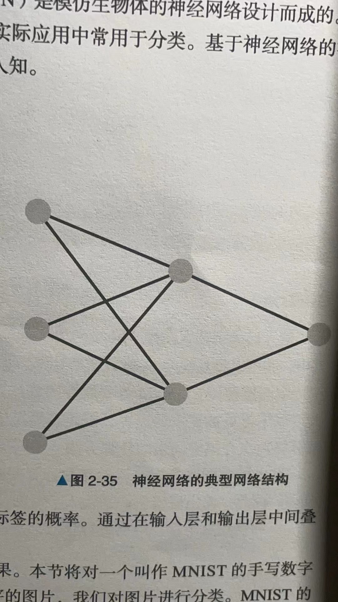
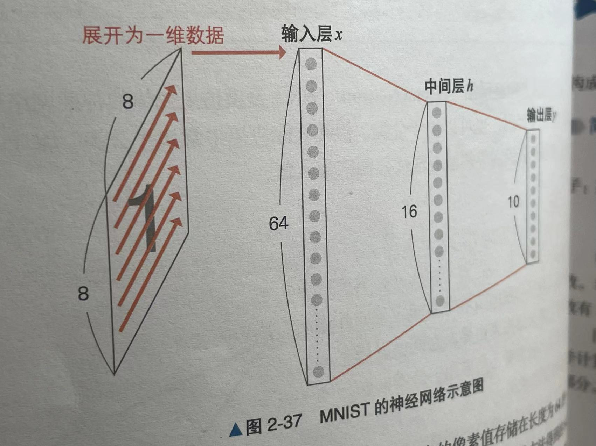
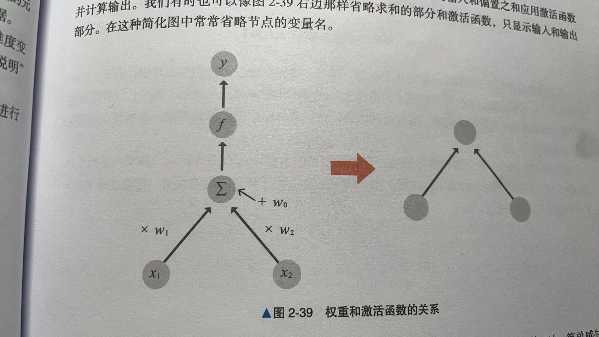
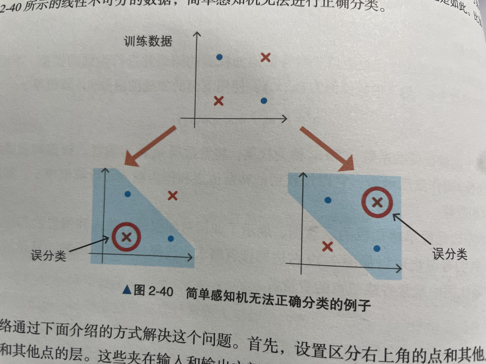
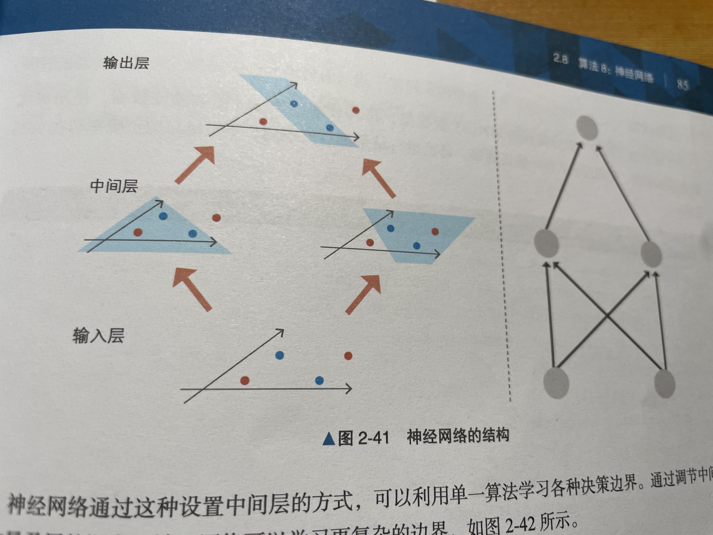

# 神经网络

神经网络(Neural Network)是模仿生物体的神经网络设计而成的。

神经网络既可以用语回归，也可以用于分类，但是在实际应用中常用于分类，基于神经网络的深度学习因在图像识别和语音识别等领域表现优异而广为人知。

## 概述

神经网络的基本原理是模仿人脑神经元的工作方式来处理信息。在人脑中，成千上万的神经元通过电信号进行交流，共同参与决策和学习过程。神经网络在计算机科学中的实现类似，它通过大量简单的单元（称为“神经元”或“节点”）相互连接来处理复杂的数据。

以下是神经网络的几个关键概念：

1. 神经元（Neuron）：人工神经网络中的基本单位，类似于人脑中的神经元。每个神经元可以接收输入，对输入进行加权，然后通过一个非线性函数（激活函数）生成输出。

2. 权重（Weights）：这些是连接神经元的参数，用于决定某个输入的重要性。在训练过程中，这些权重会不断调整以提升网络的性能。

3. 偏置（Bias）：偏置是另一种调整神经元输出的方法，它可以被视为决定神经元激活难易度的参数。

4. 激活函数（Activation Function）：激活函数决定了一个神经元是否应该被激活，它将神经元的加权输入转换为输出。常见的激活函数包括Sigmoid、ReLU（Rectified Linear Unit）等。

5. 层（Layer）：神经网络由多个层组成，每层包含多个神经元。通常分为输入层、隐藏层和输出层。输入层接收原始数据，隐藏层进行数据处理和特征提取，输出层生成最终结果。

6. 前向传播（Forward Propagation）：数据在网络中从输入层向输出层流动，每个神经元对数据进行处理的过程。

7. 反向传播（Backpropagation）：一种训练神经网络的方法，通过计算误差并将其反向传播回网络来调整权重，以减少输出和实际值之间的差异。

8. 损失函数（Loss Function）：用于衡量神经网络输出与实际值之间的差异。训练的目标是通过调整权重和偏置来最小化这个损失。

神经网络通过这些基本原理和组件，能够学习复杂的数据模式和关系，广泛应用于图像识别、语音识别、自然语言处理等领域。随着神经网络的深入和复杂度增加，它们变得更加强大，能够处理更加复杂的任务。

### 大模型中的神经网络

大型模型（如GPT系列、BERT、Transformer等）通常是基于神经网络实现的。这些大型模型通常采用了深度学习中的一些先进技术，例如：

深层架构：这些模型通常包含大量的层，这些层通过多层神经网络（例如卷积神经网络、循环神经网络、Transformer网络）构成。这些深层网络能够捕捉到数据中非常复杂和抽象的特征。

大量参数：大型模型具有巨大的参数数量，这使得它们具有非常高的学习能力和表达能力。例如，一些模型可能拥有数十亿甚至上百亿个参数。

自注意力机制（Self-Attention）：尤其是在Transformer架构中，自注意力机制使得模型能夠更有效地处理序列数据，它可以帮助模型在处理一个元素时考虑到序列中的其他元素，这在处理自然语言等序列数据时非常有效。

大规模数据集和强大的计算资源：这些大型模型通常需要大量的数据进行训练，以及强大的计算资源来处理这些数据和维持复杂的网络结构。

预训练和微调（Pre-training and Fine-tuning）：这些模型通常首先在大规模的数据集上进行预训练，以学习通用的特征和模式，然后在特定任务的较小数据集上进行微调，以适应特定的应用。

通过这些技术，大型模型能够在各种复杂任务中表现出色，如文本生成、翻译、图像识别、语音识别等。这些模型的成功证明了深度学习和神经网络在处理高维、复杂数据方面的巨大潜力。





输入数据为三维数据，中间层为二维数据，输出为一维数据。左端的层叫做输入层，表示输入数据本身，右端的层叫做输出层，获得输入数据分类结果的概率。在二元分类的情况，输出层的概率只有一个，在多元分类的情况下，输出层同时输出属于每个分类对象的标签的概率，通过在输入层和输出层中间叠加中间层，神经网络得以学习复杂的决策边界。




输入层表示输入图像(64维向量)本身，如果将各个点的像素值存储在长度为64的一维数据像素中，则可以将其视为64维数据来处理，下面通过神经网络来学习使用上述方法得到的64维数据。

中间层使用Sigmoid等非线性函数计算输入层传来的数据，中间层的维度是超参数，使维度变大可以学习更加复杂的边界，但是容易发生过拟合。

输出层也同样使用非线性函数 计算中间层传来的数据，本次任务是对0\~9这10个数字进行分类，因此，输出层输出的是输入手写图像分别为0~9这10个数字的概率。

图中的Label代表作为正确答案的数字，Prediction代表作为神经网络的分类结果的数字。

## 算法说明

通过叠加中间层，神经网络可以学习复杂的决策边界，接下来，首先介绍一下只由输入层和输出层构成的简单感知机，随后探讨如何通过叠加中间层来学习更加复杂的决策边界。

### 简单感知机

简单感知机是将非线性函数应用于对特征值加权后的结果，并进行识别的模型。

以一个例子说明：某特征的维度为2，输入的特征值为$(x_1, x_2)$，使用下面的非线性函数$f$计算概率：


$$
\begin{aligned}
y=f(w_0+w_1x_1+w_2x_2)
\end{aligned}
$$

将其中的特征值的系数$w_1$和$w_2$成为权重，将常数项$w_0$成为偏置，权重和偏置都是学习参数，非线性函数$f$叫做激活函数，它以加权后的特征值之和作为输入，计算概率$y$作为输出。常用的激活函数有Sigmoid函数。




**上图中的左边是简单感知机的示意图，展示了如何对加权后的输入和偏置之和应用激活函数，并计算输出。有时也可以向图右边那样省略求和的部分和激活函数，只显示输入和输出部分。在这种简化图中常常省略节点的变量名。**


简单感知机与逻辑回国具有类似的特性，其实再用Sigmoid函数作为激活函数$f$时，简单感知机和逻辑回归是等价的。

### 神经网络

通过叠加简单感知机，神经网络得以表示复杂的决策边界，简单感知机不能很好的学习某些数据的决策边界，逻辑回归无法成功地对非线性决策边界进行分类，简单感知机也是如此，比如，如下图的所示的不可分的数据，简单感知机也无法进行正确分类。



神经网络通过下面的方式解决这个问题，首先，设置区分右上角的点和其他店的层、区分左下角的点和其他点的层。这些夹在输入和输出之间的层叫做中间层或者隐藏层。然后，设置综合这两个输出结果并进行最终决定的层，通过这些做法，我们就可以根据数据是否进入被两条直线夹住的地方来分类了。

下图左侧表示各个层的学习情况，右侧是模型的示意图，右图表示从二维输入到两个中间层的输出，再到得到最终的输出的过程。图中的节点表示特征及其输出等变量，边表示用于进行下一个变量的计算的输入。

神经网络通过这种设置中间层的方式，可以利用单一算法学习各种决策边界，通过调节中间层的数量及层的深度，神经网络可以学习更加复杂的边界。




### 示例代码

```python
from sklearn.datasets import load_digits
from sklearn.neural_network import MLPClassifier
from sklearn.model_selection import train_test_split
from sklearn.metrics import accuracy_score


# 数据生成
data = load_digits()
X = data.images.reshape(len(data.images), -1)
y = data.target

X_train, X_test, y_train, y_test = train_test_split(X, y, test_size=0.3)
model = MLPClassifier(hidden_layer_sizes=(16, )) 
model.fit(X_train, y_train) # 训练
y_pred = model.predict(X_test) 
accuracy_score(y_pred, y_test) # 评估
```


### 代码说明

* X = data.images.reshape(len(data.images), -1)
data.images:
 data.images是一个包含手写数字图像的数组，每个图像本身是一个二维数组（或者说是一个矩阵）。在MNIST数据集中，每个图像通常是8x8像素的大小。
len(data.images):
 这部分获取了data.images中图像的总数。这是重塑数组时需要的第一个维度，表示总共有多少个图像。
 reshape(len(data.images), -1):
 .reshape是一个Numpy数组的方法，它允许你改变数组的形状而不改变其数据。
 len(data.images)是新形状的第一个维度，即图像的数量。
 -1是新形状的第二个维度。在Numpy中，使用-1作为维度参数意味着“自动计算这个维度的大小”，以便保持总数据量不变。在这种情况下，它将把每个8x8的图像展平为一个64（8x8）元素的一维数组。

因此，这行代码的作用是将一个包含多个8x8图像的三维数组转换成一个二维数组。在转换后的数组中，每一行代表一个图像，每个图像被展平成一个长度为64的一维数组。


## 详细说明

通过增加中间层的数量和增加中间层的节点数量等方法，神经网络可以学习复杂的数据，但是，模型变得复杂之后容易过拟合，介绍一种名为Early Stopping(早停法)的放置过拟合的方法。

### Early Stopping

Early Stopping是指在进入过拟合状态前停止训练的防止过你和的方法，与正则化的方法相比，它让人觉得有些不一样。

Early Stopping进一步划分训练数据，将其中一部分作为训练中的评估数据，在训练过程中使用评估数据，依次记录损失等评估指标，以了解训练的极度，在训练过程中，如果评估数据的损失开始恶化，开始已出现过拟合的趋势，就停止训练，结束学习。这种在过拟合之前停止训练的做法就叫做Early Stopping。