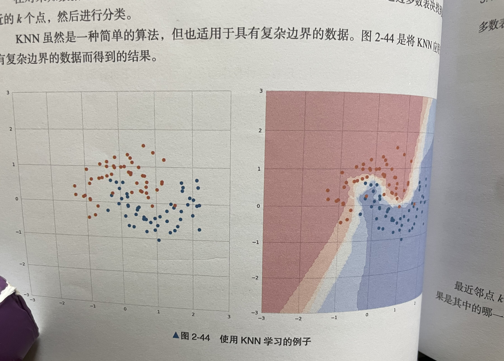

# KNN算法

KNN(K-Nearest Neighbor, K近邻)算法是一种与众不同的的机器学习算法，它只是机械地记住所有的数据。

<span style="color:red;">ML与OR中关于K近邻的概念的区别与差异</span>


<span style="color:red;">
K-Nearest Neighbor（KNN）算法在机器学习和启发式算法中都有应用，但它们在这两个领域的应用和含义略有不同。


* 机器学习中的KNN：
1. 在机器学习领域，KNN通常用于分类和回归任务。
它通过查找与给定数据点最近的K个数据点（邻居），然后根据这些邻居的信息来预测或分类该数据点。
2. 这种方法基于相似性原则，即相似的数据点可能具有相似的输出。

* 启发式算法中的K-Nearest Neighbor：
1. 在启发式算法，特别是在优化和搜索算法中，K-Nearest Neighbor的概念通常用来引导搜索过程，以便更有效地探索解空间。
2. 在这里，K个最近邻域可能被用来确定搜索的方向或者选择候选解，特别是在路径寻找、群体智能或其他基于规则的系统中。
3. 这个概念有时也用于局部搜索策略，其中算法聚焦于解空间中的一个小区域（即一个解的K个最近邻域），以寻找更优解。

* 两者的主要区别在于它们的应用目的和上下文：
1. 在机器学习中，KNN用于基于已有数据的模式来做出预测或分类。
2. 在启发式算法中，K-Nearest Neighbor的概念用于指导搜索过程，帮助算法更高效地探索解空间或改进现有解。
</span>

<span style="color:black;">

## 概述

KNN即可用于分类，也可用于回归。以二元分类为例进行说明，KNN算法在训练时机械地记住所有的训练数据，相较于其它算法要经历“根据训练数据计算最佳参数”的训练阶段和“使用计算出的学习参数进行预测”的预测阶段，KNN在训练阶段不进行任何计算，直到进入预测阶段之后才进行具体的计算。



上图中，有橙色和蓝色两个标签的训练数据，在右图中，散点图中的所有点被分为两个标签，分类结果显示在热图中。最近邻点的数量$k$设置为5，热图中每个坐标的颜色表示$k$个最近的邻标签的占比，暗红色区域标识$k$个点的标签都是橙色的，随着比例接近1:1，颜色会变浅，接近于蓝色。结果表明KNN算法能够对复杂数据进行学习。

## 算法说明

KNN是一种在训练时机械地记住所有数据的简单算法。该算法使用训练数据对未知输入数据进行分类的步骤如下：

1. 计算输入数据与训练数据之间的距离；
2. 得到距离输入数据最近的$k$个训练数据；
3. 对训练数据的标签进行多数表决，将结果作为分类结果。

最近邻点$k$的数量是一个超参数，在二元分类时，通常取$k$为奇数，这样多数表决才能决定结果是其中的哪一个。

## 示例代码

```python
from sklearn.neighbors import KNeighborsClassifier
from sklearn.datasets import make_moons
from sklearn.model_selection import train_test_split
from sklearn.metrics import accuracy_score


# 数据生成
X, y = make_moons(noise=0.3)
X_train, X_test, y_train, y_test = train_test_split(X, y, test_size=0.3)
model = KNeighborsClassifier() 
model.fit(X_train, y_train) # 训练
y_pred = model.predict(X_test) 
accuracy_score(y_pred, y_test) # 评估
```

### 代码说明

当然，让我来解释这段代码的每一部分：

导入必要的库：

matplotlib.pyplot 用于绘图。
numpy 用于进行科学计算。
sklearn 中的相关模块用于生成数据集、拆分数据、标准化数据和创建KNN分类器。
ListedColormap 用于自定义颜色映射。
生成和处理数据：

使用 datasets.make_moons 生成两个半圆形区域的数据。
使用 StandardScaler 对数据进行标准化处理，以保证每个特征的平均值为0，方差为1。
使用 train_test_split 将数据拆分为训练集和测试集。
训练KNN模型：

使用 KNeighborsClassifier 创建KNN分类器实例，设置邻居数为5（这里是假设值，实际应根据具体问题来确定）。
使用训练数据 X_train 和 y_train 来训练模型。
创建彩色地图：

cmap_light 和 cmap_bold 定义了用于绘图的颜色。cmap_light 用于决策区域的颜色，而 cmap_bold 用于训练点的颜色。
绘制决策边界：

首先，定义了图的x轴和y轴的范围。
使用 np.meshgrid 生成所有预测点的网格。
调用 knn.predict 预测这些点的分类。
使用 pcolormesh 将决策区域填充相应的颜色。
绘制训练点：

使用 plt.scatter 绘制训练数据点，颜色表示它们的类别。
显示图形：

设置图形的标题，并显示图形。

## 详细说明
 
### 决策边界因$k$值而已

在KNN中，$k$值是一个超参数，可以通过改变$k$值来看一下识别出的决策边界如何变化。

在下图中，从左到右分别为$k$=1, 5, 30时的决策边界，当$k=1$时，图中出现了一些像飞地一样的决策边界，这说明发生了过拟合，中间的图像的决策边界变得平滑，我们看不到在$k=1$时出现的飞地，所以$k=5$比$k=1$更好，而当$k=30$时，背景为橙色的区域内夹杂着好多蓝色的点，这是边界过于宽松导致的错误判断。

k的值不同会导致学到的决策边界的外观发生变化，我们需要像其他算法一样对k值进行调优，得到最优的k值。

### 注意点

当数据量较少或者维度较小时，KNN的效果很好，但是当数据量较大或者维度较大时，我们就需要考虑其他方法。

首先看一下数据量较大的情况，由于要处理大量的训练数据，所以分类将变慢，这是由于在对未知数据进行分类时，KNN需要在大量的训练数据上进行近邻搜索一找到最近的点，这就意味着KNN需要同时存储大量的训练数据，也就意味着需要存储容量，为了高效地进行近邻搜索，通常借助于利用树结构存储训练数据的技术，但是一般来说，KNN 不适合处理大规模的训练数据。

KNN也无法很好的学习高维数据，KNN起作用的前提是“只要拥有的训练数据多，就能在未知数据的附近发现训练数据”这一假设，这个假设叫做渐进假设，但对于高维数据来说，这个假设不一定成立。对于高纬的音频和图像数据，需要考虑其他方法。


## 辅助知识

在机器学习中，超参数（Hyperparameters）是指那些在开始学习过程之前需要设置的参数。与模型参数不同，超参数不是通过训练数据学习得来的，而是用来控制学习过程本身的。理解超参数的关键点如下：

* 定义：超参数是在训练开始之前设置的，用于指导学习过程的参数。例如，在决策树模型中，树的最大深度就是一个超参数；在K-Nearest Neighbors模型中，邻居的数量K就是一个超参数。

* 影响模型性能：超参数对模型的性能和能力有重大影响。选择正确的超参数组合可以显著提高模型的精度和效果。

* 不同于模型参数：模型参数是模型在学习过程中从数据中学到的，比如神经网络的权重。而超参数则是用来控制这个学习过程的，比如学习率、迭代次数等。

* 调优的重要性：超参数调优（Hyperparameter Tuning）是机器学习中的一个重要环节。它涉及到选择一组能使模型达到最佳性能的超参数。这通常通过网格搜索（Grid Search）、随机搜索（Random Search）或者基于贝叶斯优化的方法进行。

* 示例：

* 在神经网络中，学习率、批大小（batch size）、迭代次数（epochs）、网络层数和每层的神经元数量等都是超参数。
在支持向量机（SVM）中，C（正则化系数）和gamma（核函数的参数）是常见的超参数。
* 依赖于具体模型：不同的机器学习模型有不同的超参数。有些超参数（如学习率）在多种模型中都存在，而有些则是特定于某一类模型的。

* 无单一最优解：通常没有一组超参数适用于所有问题。超参数的最佳组合通常依赖于具体的数据集和任务。